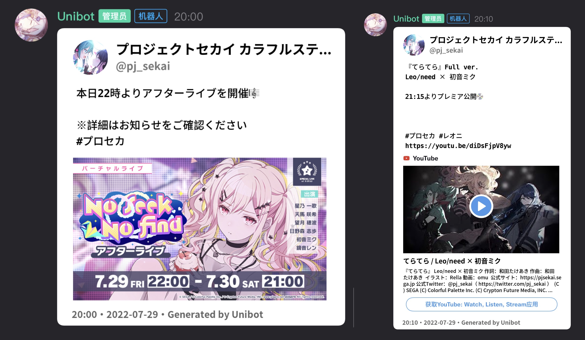
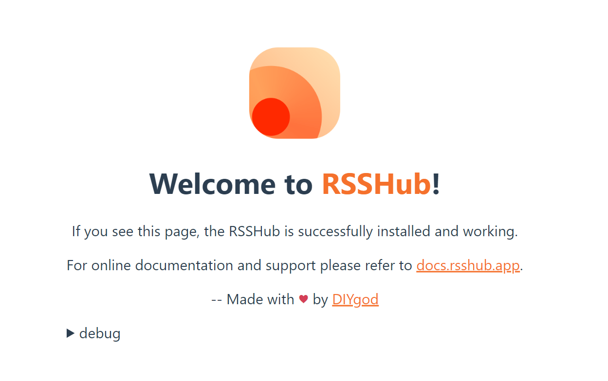
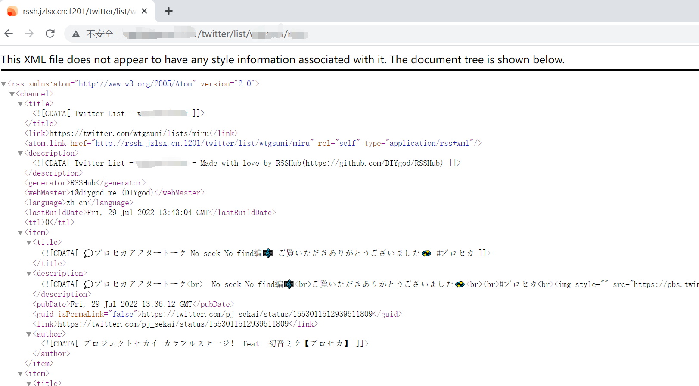

# Unibot 推特推送模块

基于 [RSSHUB](https://docs.rsshub.app/)，[Onebot](https://github.com/botuniverse/onebot) HTTP 协议的QQ群/频道推特推送模块

## 示例



## 部署

该项目部署需要准备自建 [RSSHUB](https://docs.rsshub.app/)，[Twitter Developer Account](https://apps.twitter.com/)，[YouTube API](https://console.developers.google.com/)，一些操作较为繁琐，如果你不知道上面这些是什么，也不会善用搜索引擎，请放弃部署，不要浪费宝贵的时间。

### 准备工作

你需要一个支持 [Onebot](https://github.com/botuniverse/onebot) 协议的机器人框架，如 QQ端 [go-cqhttp](https://github.com/Mrs4s/go-cqhttp)，QQ频道端 [chinosk114514/QQ-official-guild-bot](https://github.com/chinosk114514/QQ-official-guild-bot)

该项目刷新依赖 [RSSHUB](https://docs.rsshub.app/) 源，官方提供的地址缓存时间太长，不适合做及时推特推送，所以简易自建 RSSHUB。你也可以白嫖别人的，但缓存时间很短的公开 RSSHUB 一般很难找到。自建可参考 [RSSHUB部署文档](https://docs.rsshub.app/install/)

注意：如果自建 RSSHUB，你需要注册一个 [Twitter Developer Account](https://apps.twitter.com/)，然后根据 [部分 RSS 模块配置](https://docs.rsshub.app/install/#pei-zhi-bu-fen-rss-mo-kuai-pei-zhi) 中 `Twitter 全部路由` 的介绍将一些值填入相应的位置。

自建完成后，如果打开你的url显示如下页面则代表成功。



油管视频数据抓取需要 YouTube API，[申请地址](https://console.developers.google.com/)。

然后重命名`config.example.py`到`config.py`，将你的 RSSHUB 地址（带最后的斜杠），googleapiskey 填入相应的地方。如果你不需要代理，请将`proxies` 的值改为 `None`。如果你不想注册 YouTube API，可以将`googleapiskey`的值设为`None`，这样推文带有youtube链接时将不会自动解析。

然后准备一个公开的推特账号，新建一个列表，推特id和列表名字要是全英文，不能太长。之后在列表内添加你要抓取的推特账号。

> 注意：将推特添加到公开列表，对方会收到通知，不适合推送粉丝比较少的个人推特

尝试一下访问`你的rsshub地址/twitter/list/你的推特id/你的列表名`，如果一切正常，网页会显示一个带有列表用户最新推文的xml。



如果没有问题，打开`config.py`，将`你的推特id/你的列表名`填入`twitterlist`项

如果显示错误，请检查列表是否公开，推特是否公开，列表用户是否有最近的推文，推特id和列表id是否全英文并且很短（很长的id一定概率无法识别）

然后在 [SkywalkerSpace/emoji2pic-python](https://github.com/SkywalkerSpace/emoji2pic-python) 项目的 releases 里下载图片包，解压到当前项目根目录下的`AppleEmoji`文件夹内（打开该文件夹后应全是emoji图片）

然后在当前项目根目录下新建一个`piccache`文件夹

如果上面这些都完成且无问题，恭喜你，你已经完成了相应的准备工作。

### go-cqhttp端配置

下载 [GO-CQHTTP](https://github.com/Mrs4s/go-cqhttp/releases)

打开 cqhttp 按提示创建bat文件，打开后, 通信方式选择: HTTP通信

在 CQHTTP 配置文件中，填写 `address` 值为 `0.0.0.0:5678`，这里 `5678` 可改为任意端口号，如果修改，则需要在`config.py`内将`groupport`修改成一样的值

最后的连接服务列表应该是这样的格式
```yaml
# 连接服务列表
servers:
  # 添加方式，同一连接方式可添加多个，具体配置说明请查看文档
  #- http: # http 通信
  #- ws:   # 正向 Websocket
  #- ws-reverse: # 反向 Websocket
  #- pprof: #性能分析服务器

  - http: # HTTP 通信设置
      address: 0.0.0.0:5678 # HTTP监听地址
      timeout: 5      # 反向 HTTP 超时时间, 单位秒，<5 时将被忽略
      long-polling:   # 长轮询拓展
        enabled: false       # 是否开启
        max-queue-size: 2000 # 消息队列大小，0 表示不限制队列大小，谨慎使用
      middlewares:
        <<: *default # 引用默认中间件
      post:           # 反向HTTP POST地址列表
      #- url: ''                # 地址
      #  secret: ''             # 密钥
      #  max-retries: 3         # 最大重试，0 时禁用
      #  retries-interval: 1500 # 重试时间，单位毫秒，0 时立即
      #- url: http://127.0.0.1:5701/ # 地址
      #  secret: ''                  # 密钥
      #  max-retries: 10             # 最大重试，0 时禁用
      #  retries-interval: 1000      # 重试时间，单位毫秒，0 时立即
```
之后启动cqhttp按提示登陆你的账号，如果能正常显示收到的群信息，就代表配置完成了。

### QQ-official-guild-bot配置

如果你有使用QQ频道官方机器人推送的需求，则需要进行如下配置

下载 [chinosk114514/QQ-official-guild-bot](https://github.com/chinosk114514/QQ-official-guild-bot) 到本地，安装相关依赖，然后修改`main.py`，按照提示自行注册一个图片转url方法（该项目会将图片保存到本地，但是频道官方bot发送图片需要网址，如果你的服务器没有公网ip，建议放弃）

可修改`port_listen`，默认为`1988`，如修改，则需要在`config.py`内将`guildport`修改成一样的值

之后填写你的bot token, 你的bot secret，启动 `main.py`

### 推送群配置

重命名`twitterpush.example.yaml`到`twitterpush.yaml`，按照格式填入你要推送的id和对应群号，如果不需要频道bot推送可直接上去下面的`guild`项

```yaml
group:
  pj_sekai: # 要推送的id 区分大小写
  - 123 # 要推送的群号1
  - 456 # 要推送的群号2
guild:
  pj_sekai: # 要推送的id 区分大小写
  - 789 # 要推送的子频道id
```

可以自己添加一个测试账号，然后运行`start.py`，在第一次抓取后用测试账号尝试随便发一个推，如果配置得当则会推送到设置的相应群

## 支持与贡献

觉得好用可以给这个项目点个 Star 。

有意见或者建议也欢迎提交 [Issues](https://github.com/watagashi-uni/Unibot/issues) 和 [Pull requests](https://github.com/watagashi-uni/Unibot/pulls)。


## 特别感谢
- [Mrs4s/go-cqhttp](https://github.com/Mrs4s/go-cqhttp): 基于 [Mirai](https://github.com/mamoe/mirai) 以及 [MiraiGo](https://github.com/Mrs4s/MiraiGo) 的 [OneBot](https://github.com/howmanybots/onebot/blob/master/README.md) Golang 原生实现 
- [Lxns-Network/nakuru-project](https://github.com/Lxns-Network/nakuru-project)：一款为 go-cqhttp 的正向 WebSocket 设计的 Python SDK
- [chinosk114514/QQ-official-guild-bot](https://github.com/chinosk114514/QQ-official-guild-bot): QQ官方频道机器人SDK
- [SkywalkerSpace/emoji2pic-python](https://github.com/SkywalkerSpace/emoji2pic-python): Apple emoji and text to picture

